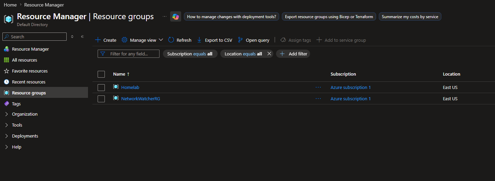
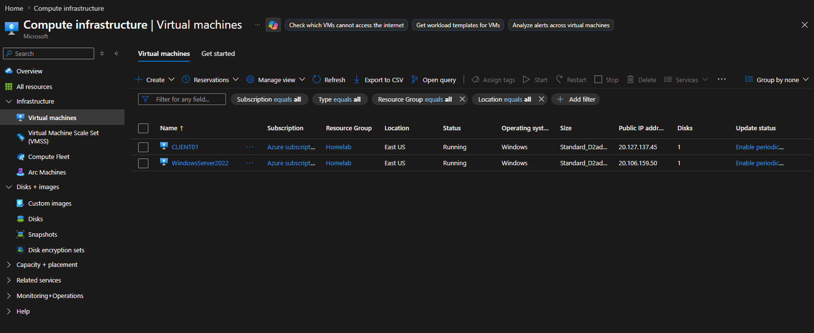
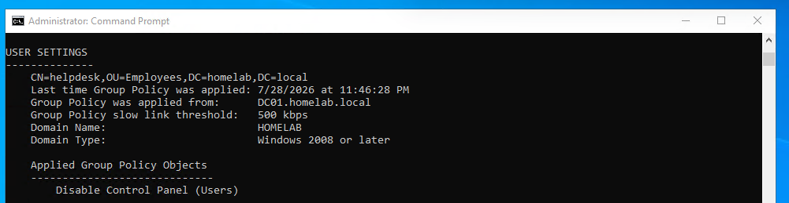
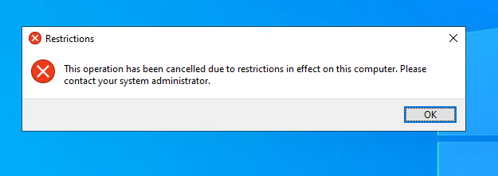

# 🏢 Active Directory Homelab in Microsoft Azure

> **Status:** ✅ Completed

> Enterprise Active Directory lab built in Microsoft Azure to develop hands-on experience with Windows Server administration, Identity & Access Management (IAM), DNS, Organizational Units (OUs), Security Groups, Role-Based Access Control (RBAC), and Group Policy.

---

# 📌 Project Overview

This project demonstrates the deployment and administration of an enterprise-style Active Directory environment in Microsoft Azure. The lab was built to gain practical experience with Windows Server administration, Identity & Access Management (IAM), DNS, Organizational Units (OUs), Security Groups, Role-Based Access Control (RBAC), and Group Policy Objects (GPOs).

The environment simulates a small corporate network consisting of a Domain Controller and a domain-joined workstation. Throughout the project, I configured core Active Directory services, managed users and groups, implemented Group Policy, and troubleshot policy application issues to strengthen my understanding of Windows identity administration.

---

# 🏗️ Lab Architecture

```text
                              Microsoft Azure
                                     │
                        Resource Group: HOMELAB
                                     │
          ┌──────────────────────────┴─────────────────────────┐
          │                                                    │
┌─────────────────────────┐                      ┌─────────────────────────┐
│    WindowsServer22      │                      │        CLIENT01         │
│ Windows Server 2022     │                      │ Windows Server 2022     │
│ Active Directory        │                      │ Domain Joined           │
│ DNS Server              │                      │ Authenticated via AD    │
└─────────────────────────┘                      └─────────────────────────┘
                     │
             Domain: homelab.local
```

---

# 🧰 Lab Environment

| Component | Configuration |
|-----------|---------------|
| Cloud Platform | Microsoft Azure |
| Resource Group | HOMELAB |
| Domain | homelab.local |
| Domain Controller | WindowsServer2022 |
| Client Machine | CLIENT01 |
| Operating System | Windows Server 2022 |
| Identity Service | Active Directory Domain Services (AD DS) |
| DNS | Windows DNS |

---

# 💻 Technologies Used

- Microsoft Azure
- Windows Server 2022
- Active Directory Domain Services (AD DS)
- DNS Server
- Group Policy Management
- Remote Desktop (RDP)
- Windows Command Prompt

---

# 🎯 Project Objectives

- Deploy an Active Directory environment in Microsoft Azure
- Configure Active Directory Domain Services (AD DS)
- Configure DNS
- Join a workstation to the domain
- Create Organizational Units (OUs)
- Create users and security groups
- Implement Role-Based Access Control (RBAC)
- Configure and troubleshoot Group Policy Objects (GPOs)

---

# ☁️ Azure Infrastructure

## Resource Group



## Virtual Machines



The environment consists of one Windows Server Domain Controller (DC01) and one domain-joined workstation (CLIENT01) deployed within Microsoft Azure.

---

# 🖥️ Active Directory Deployment

## Active Directory Users and Computers


Installed and configured:

- Active Directory Domain Services (AD DS)
- DNS Server

Created the Active Directory domain:

```
homelab.local
```

---

# 🗂️ Organizational Units


Created Organizational Units to organize users, computers, groups, and service accounts similarly to a production Active Directory environment.

Organizational Units created:

- Employees
- Workstations
- Groups
- Servers
- Service Accounts

---

# 🔐 Domain Join


Successfully joined CLIENT01 to the **homelab.local** domain and verified domain authentication.

---

# 👥 Security Groups


Created security groups and assigned users following Role-Based Access Control (RBAC) principles.

Implemented:

- Security Groups
- Group Membership
- Principle of Least Privilege

---

# 🛡️ Group Policy Management

## Group Policy Management Console


Created and linked a User Configuration Group Policy Object (GPO) to the Employees Organizational Unit.

## Group Policy Editor


Configured the following policy:

```text
User Configuration
 └── Policies
      └── Administrative Templates
           └── Control Panel
                └── Prohibit access to Control Panel and PC settings
```

---

# ✅ Policy Verification

## gpresult



Verified successful Group Policy application using:

```cmd
gpresult /r
```

Confirmed the policy was successfully applied to the user.

---

# 🎉 Final Result



Successfully prevented users from accessing the Windows Control Panel using Group Policy.

---

# 🛠️ Troubleshooting

One of the most valuable parts of this project involved troubleshooting a Group Policy issue.

Initially, the User Configuration policy did not apply because the user account was located inside the default **Users** container rather than an Organizational Unit.

To diagnose the issue, I used:

- `gpupdate /force`
- `gpresult /r`
- Group Policy Management Console
- Active Directory Users and Computers

After reviewing the Group Policy results, I determined that User Configuration policies follow the user's Organizational Unit. Once the user account was moved into the **Employees** OU and the Group Policy Object was correctly linked, the policy applied successfully.

This troubleshooting process reinforced my understanding of how Active Directory processes User Configuration versus Computer Configuration policies and strengthened my overall troubleshooting methodology.

---

# 🛠️ Skills Demonstrated

- Active Directory Administration
- Windows Server Administration
- Microsoft Azure Virtual Machines
- DNS Configuration and Management
- Domain Join Operations
- Organizational Unit (OU) Design
- User and Group Management
- Security Group Administration
- Role-Based Access Control (RBAC)
- Group Policy Management
- Group Policy Troubleshooting
- Windows Authentication

---

# 📚 Key Takeaways

This project strengthened my understanding of how enterprise Active Directory environments are deployed and managed. I gained hands-on experience configuring DNS, Organizational Units, Security Groups, Group Policy, and Windows authentication within Microsoft Azure.

The most valuable learning experience was troubleshooting a Group Policy issue caused by incorrect Organizational Unit placement. Working through the problem reinforced the relationship between Active Directory structure and Group Policy processing while improving my troubleshooting methodology.

---

